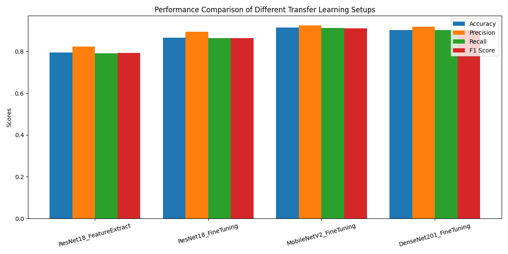
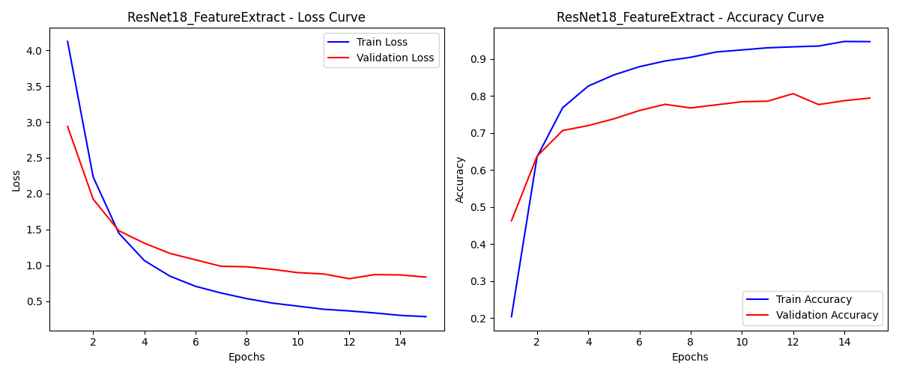
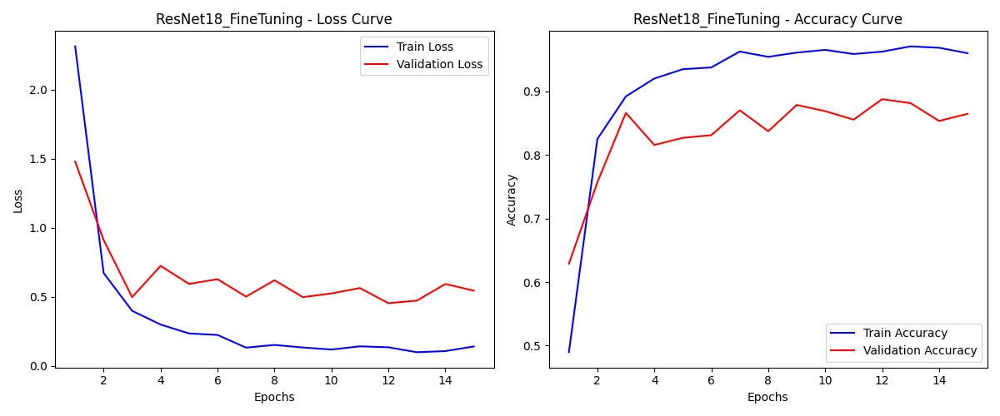
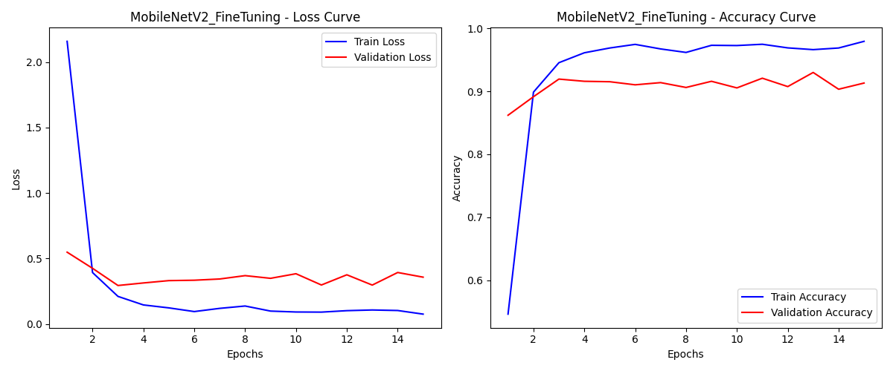
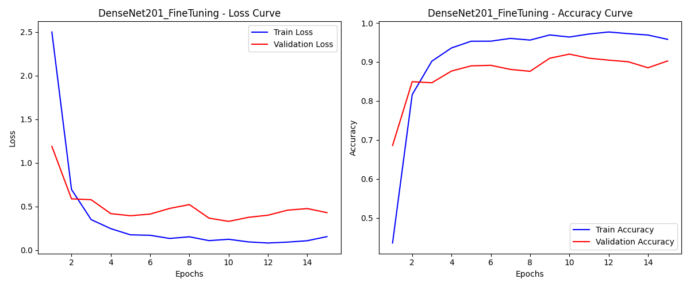

# pokemon-classifier-transfer-learning

**Description:** My Pokemon image classifier using Transfer Learning (ResNet18, MobileNetV2, DenseNet201) with a Streamlit GUI. 

## 1. Project Overview
This project predicts the name of a Pokemon from a given image. It utilizes a dataset of 7,000 labeled images spanning 150 Pokemon classes. The goal is to compare different transfer learning setups and deploy a simple web-based demonstration.

## 2. Experimental Setups
To evaluate the effectiveness of transfer learning, four different model configurations were tested:
* **Setup 1:** ResNet18 Feature Extractor (Pre-trained weights, frozen base layers)
* **Setup 2:** ResNet18 Fine-tuning (Pre-trained weights, all layers trained)
* **Setup 3:** MobileNetV2 Fine-tuning (Pre-trained weights, all layers trained)
* **Setup 4:** DenseNet201 Fine-tuning (Pre-trained weights, all layers trained)

## 3. Performance Evaluation

**Performance Chart**  


**Learning Curves**  
  
  
  


## 4. How to Run

**Installation**
```bash
pip install -r requirements.txt
```

**Data Preparation**
Extract the Kaggle dataset into a folder named `PokemonData`, then run the split script:
```bash
python prepare_data.py
```

**Training and Evaluation**
```bash
python train_eval.py
```

**Run the Streamlit Demo**
```bash
streamlit run app.py
```

## 5. Demo


**Demo GIF**  

